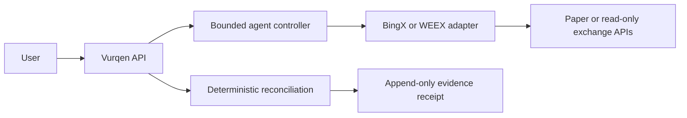

# Vurqen

Evidence-first incident response for exchange-connected AI trading workflows.

Vurqen records an order intent, checks provider state, detects uncertainty, blocks unsafe retries, and exports a receipt that explains what the exchange actually returned.

## The proof run

```text
record intent -> capture provider evidence -> introduce a controlled fault
-> reconcile against order history -> block an unsafe retry -> export receipt.json
```

The current backend runs against BingX VST simulated trading and supports a WEEX V3 adapter. It never requests withdrawal permission and never uses live funds by default.

## Architecture



## Quick start

Requirements: Node.js 20 or newer.

```bash
npm ci
cp .env.example .env.local
npm run build
npm test
```

For a real provider smoke run, add BingX VST credentials to `.env.local` and run:

```bash
npm run smoke
```

The smoke flow makes read-only balance, contract, ticker, order-history, and WebSocket requests. It does not place an order.

Run the API locally with:

```bash
npm run dev
```

The default address is `http://localhost:8787`.

Replay mode stays offline. Add a replay `ORDER_STATE` observation before reconciliation when you want to test a matching provider state. Include the order symbol, client ID, side, type, status, quantity, and limit price when applicable. WEEX replay states also need `positionSide`. The API blocks reconciliation when authoritative replay state is missing or incomplete.

## API

| Method | Path | Purpose |
|---|---|---|
| GET | `/api/health` | Provider and model readiness |
| POST | `/api/runs` | Create a paper, read-only, or replay run |
| POST | `/api/runs/:runId/preflight` | Run provider checks |
| POST | `/api/runs/:runId/intents` | Record an intent and capture market evidence |
| POST | `/api/runs/:runId/faults` | Apply a labeled controlled fault |
| POST | `/api/runs/:runId/reconcile` | Run bounded diagnosis and reconciliation |
| GET | `/api/runs/:runId/receipt.json` | Download the run receipt |
| GET | `/api/incidents/:incidentId` | Inspect an incident and receipt |
| GET | `/api/incidents/:incidentId/receipt.json` | Download an incident receipt |

## Provider integrations

- BingX: VST balance, contract metadata, ticker, order history, signed paper-order submission, and bounded reconciliation.
- WEEX: V3 paper balance, positions, order history, exchange information, and signed paper-order submission. WEEX `positionSide` defaults to `LONG`; set `SHORT` for short-side hedge orders.
- Gemini: structured incident explanations using `gemini-2.5-flash`.
- Groq: optional explanation fallback.

Provider credentials stay on the server. Set `VURQEN_API_TOKEN` when exposing private routes outside a local environment.
Browser access is disabled by default. Set `VURQEN_CORS_ORIGIN` to one trusted origin when a browser client is required.

## Safety boundary

Vurqen is a reconciliation and evidence service. It does not provide investment advice, generate strategies, custody funds, or submit live-money orders. An unresolved order is terminal for that run and cannot be retried through the API.

Controlled faults are labeled in the stored observation and receipt. Replay data is never presented as live exchange behavior.

## Verification

```bash
npm run check
npm run lint
npm run smoke
npm audit --audit-level=moderate
```

The test suite covers signing guards, provider adapters, state transitions, duplicate and missing observations, AI response validation, persistence, receipts, and HTTP routes.

## License

MIT
