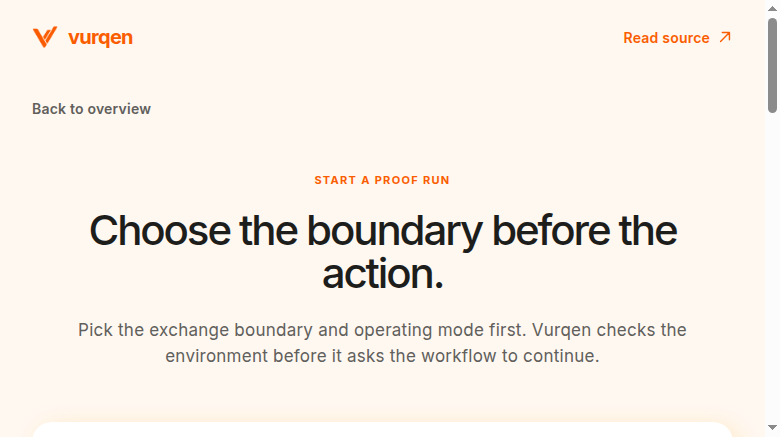
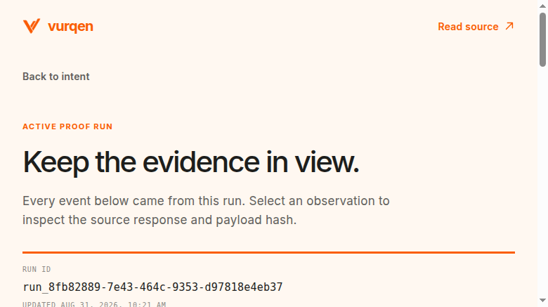
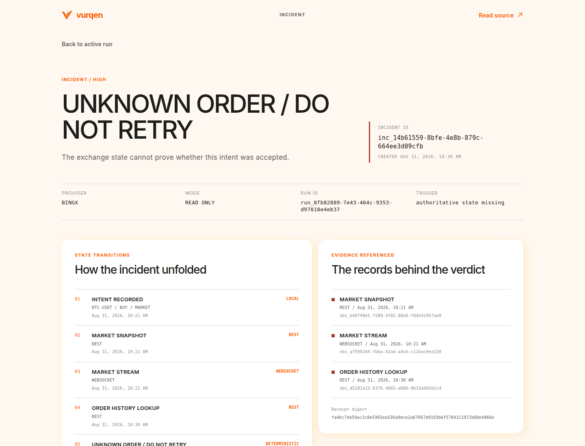
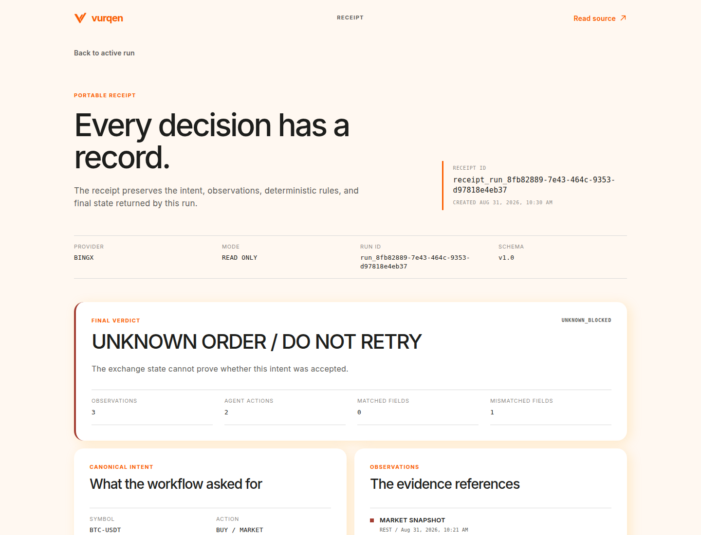
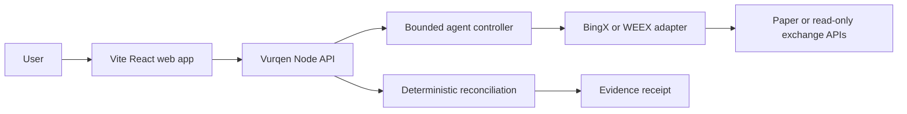

# Vurqen

Vurqen stops an exchange-connected agent from blindly retrying when the exchange cannot prove what happened, then exports the evidence.

## The proof run

Vurqen records a canonical intent, captures provider observations, labels local faults, reconciles against authoritative order state, returns a deterministic verdict, and exports a receipt.

```text
intent -> observations -> controlled fault -> reconciliation -> verdict -> receipt
```

The product never requests withdrawal permission or uses live funds by default. `REPLAY` data is always labeled as replay data.

## Screens






## Architecture



The API owns run state, provider calls, verdicts, and receipts. The controller selects bounded diagnostic actions. The deterministic engine owns reconciliation. The AI layer can explain supplied evidence but cannot assign or override a verdict.

## Run locally

Requirements: Node.js 20 or newer.

```bash
npm ci
cp .env.example .env.local
npm run check
npm run dev
```

The API listens on `http://localhost:8787`.

In a second terminal, run the frontend:

```bash
npm ci --prefix web
VITE_API_PROXY=http://127.0.0.1:8787 npm run dev --prefix web
```

Open `http://localhost:5173`. Start at `/run/new`, choose a provider and mode, run preflight, record an intent, inspect evidence, reconcile, and download the receipt.

For a protected production-style web process, build the frontend and run the same-origin proxy. Keep the API token in the server environment. It is never placed in the client bundle.

```bash
npm run build --prefix web
VURQEN_API_URL=http://127.0.0.1:8787 WEB_PORT=4173 npm start --prefix web
```

Set the same `VURQEN_API_TOKEN` in the API and web proxy environments when `NODE_ENV=production`.

## Provider proof

- BingX VST: verified locally for balance, contract metadata, market ticker, WebSocket ticker, paper-order submission, and bounded order reconciliation.
- WEEX V3: adapter support covers paper and read-only request shapes, signing, exchange information, balances, positions, order history, paper orders, and public WebSocket capture. A real WEEX paper run still requires provider credentials.
- Replay: deterministic local observations and controlled faults for reproducible testing. Replay is never presented as live provider behavior.

## Safety boundary

Vurqen does not generate trading strategies, provide investment advice, custody funds, handle withdrawals, or submit live-money orders. An unresolved order cannot be retried as an order. Reconciliation may be run again to obtain fresh authoritative evidence.

Provider credentials stay server-side. A production deployment must use HTTPS and protect private API routes with `VURQEN_API_TOKEN`. Evidence sent to the configured AI provider should not contain secrets.

## API

| Method | Path | Purpose |
|---|---|---|
| GET | `/api/health` | Provider and model configuration summary |
| POST | `/api/runs` | Create a paper, read-only, or replay run |
| GET | `/api/runs/:runId` | Read a run and its evidence |
| POST | `/api/runs/:runId/preflight` | Run provider checks |
| POST | `/api/runs/:runId/intents` | Record an intent and capture observations |
| POST | `/api/runs/:runId/observations` | Add a replay observation |
| POST | `/api/runs/:runId/faults` | Apply a labeled local fault |
| POST | `/api/runs/:runId/reconcile` | Run bounded diagnosis and reconciliation |
| GET | `/api/runs/:runId/receipt.json` | Download a run receipt |
| GET | `/api/incidents/:incidentId` | Inspect an incident and receipt |
| GET | `/api/incidents/:incidentId/receipt.json` | Download an incident receipt |

## Verification

```bash
npm run check
npm run lint
npm run smoke
npm audit --audit-level=moderate
npm ci --prefix web
npm run typecheck --prefix web
npm run build --prefix web
```

The backend tests cover provider signing, malformed responses, duplicate and missing observations, unknown orders, mismatches, partial fills, concurrent requests, AI evidence validation, persistence, and receipt consistency. The frontend route smoke checks the built SPA routes and assets.

## License

MIT
